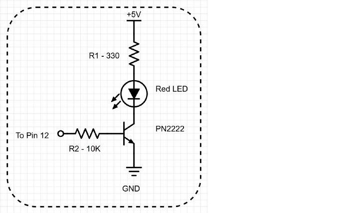
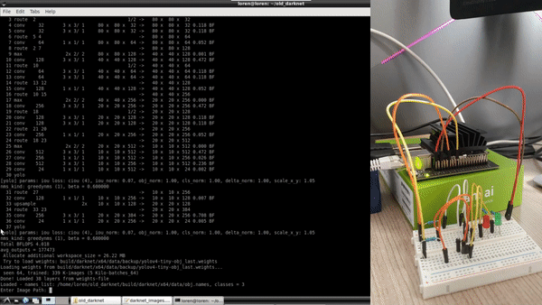

# Face Mask Yolov4 detector - Nvidia Jetson Nano


## Citations
This is a project for the Jetson Community and couldn't be possible without the effort of other developers. All the YoloV4 / Darknet code and documentation can be found here:

* [Pjreddie - Darknet](https://pjreddie.com/darknet/)
* [AlexeyAB/darknet](https://github.com/AlexeyAB/darknet)


## Index

0. [Previous tips](#previous-tips)
1. [Dataset](#Dataset)
    1. [Downloading the dataset](#Downloading-the-dataset)
    2. [Conversion to Yolo format](#Conversion-to-Yolo-format)
2. [YoloV4](#YoloV4)
    1. [Compiling YoloV4 on Nvidia Jetson Nano](#Compiling-YoloV4-on-Nvidia-Jetson-Nano)
    2. [Testing YoloV4 with COCO](#Testing-YoloV4-with-COCO)
    3. [Training the Mask Detector](#Training-the-Mask-Detector)
    4. [Led Control](#Led-Control)


## Previous tips
During the development of this project I use SSH, SCP and VNC Viewer for controlling and file-transfer from my PC to Jetson Nano board. You can control it directly from the board with a keyboard and mouse but this way is more unconfortable from my point of view:
 * [Setup VNC server on the Jetson developer kit](https://developer.nvidia.com/embedded/learn/tutorials/vnc-setup)
 * [How To Use SSH To Connect To A Remote Server In Linux Or Windows](https://phoenixnap.com/kb/ssh-to-connect-to-remote-server-linux-or-windows)
 * [How to Use SCP Command to Securely Transfer Files](https://linuxize.com/post/how-to-use-scp-command-to-securely-transfer-files)

## Dataset
For this project I used the Kaggle's [Face Mask Detection](https://www.kaggle.com/andrewmvd/face-mask-detection) dataset with 853 images belonging to 3 classes. Each image has one or many bounding boxes.

The classes are:
 * With mask
 * Without mask
 * Mask worn incorrectly

I recomend use [Google Dataset Search](https://datasetsearch.research.google.com/) to find any kind of dataset, in this case this dataset maybe its a bit small but I've got a good accuracy, if you want you can make it bigger with your own images or any other dataset.

### Conversion to Yolo format
Yolo needs an specific notation for train the model and .jpg file format, so first of all you have to go to images folder and run:
```
$> sudo apt-get install imagemagick

$> mogrify -format jpg *.png
```
Now with the images on jpg format next step is to parse .xml to yolo format and create train/test .txt files. Just drop the xml_to_yolo.py python script inside annotations folder and run it with:

```
$> python3 xml_to_yolo.py
```
If you haven't any library just install it with pip/pip3.

After that you will have one .txt per .xml file, train.txt and test.txt (These file has a split 90/10 of the total of bounding boxes).

## YoloV4
All the YoloV4 code is develop by [AlexeyAB/darknet](https://github.com/AlexeyAB/darknet), there you can find great documentation and examples about how to train, metrics, etc.

### Compiling YoloV4 on Nvidia Jetson Nano
First of all you have to clone [AlexeyAB repository](https://github.com/AlexeyAB/darknet)

```
$ git clone https://github.com/AlexeyAB/darknet.git
$ cd darknet
```

Edit the Makefile with:

```
GPU=1
CUDNN=1
CUDNN_HALF=1
OPENCV=1
AVX=0
OPENMP=1
LIBSO=1
ZED_CAMERA=0
ZED_CAMERA_v2_8=0

......

USE_CPP=0
DEBUG=0

ARCH= -gencode arch=compute_53,code=[sm_53,compute_53]

......

NVCC=/usr/local/cuda/bin/nvcc

```

And run make:

```
$ make
```
### Testing YoloV4 with COCO

After that the project is compiled and just need the trained weights to run it. I recommend to use Tiny-Yolo if you want a higher FPS performance. You can download both from AlexeyAB repository:

 * [yolov4.weights](https://github.com/AlexeyAB/darknet/releases/download/darknet_yolo_v3_optimal/yolov4.weights)
 * [yolov4-tiny.weights](https://github.com/AlexeyAB/darknet/releases/download/darknet_yolo_v4_pre/yolov4-tiny.weights)

To run darknet just:

```
./darknet detector demo cfg/coco.data \
                          cfg/yolov4-tiny.cfg \
                          yolov4-tiny.weights \
                          -c 0
```
The ```-c 0``` means using the camera (V4L2) device at ```/dev/video0```. 

### Training the Mask Detector

To train a new YoloV4-Tiny model just follow [AlexeyAB steps](https://github.com/AlexeyAB/darknet#how-to-train-tiny-yolo-to-detect-your-custom-objects) or use my files and .weights. It takes about 20 hours to finish the 6000 steps (2000x3 classes).

To run with my trainning:
```
./darknet detector demo cfg/obj.data \
                          cfg/yolov4-tiny-masks.cfg \
                          yolov4-tiny-obj_last.weights \
                          -c 0
```

### Led Control

To finish the project I wanted to use this detections to create "traffic lights", that's just a silly experiment but the possibilities are endless...

Once you have the model loaded you can run it from darknet_video.py or darknet_images.py, on this case I use darknet_images.py ```import RPi.GPIO as GPIO ``` and added an if-else statement to control detections and set high-low values to the pins output.

The circuit I created if this one with 2 leds and 2 PN2222 transistors one for the green led and the other one for the red. 


The pins are mapped this way:

```
    pinGreen =  18 #Green led -> Pin 12 on the board
    pinRed = 24 #Red led -> Pin 18 on the board
```
Thats an useful image to see how BCM maps works:


Live demo:


